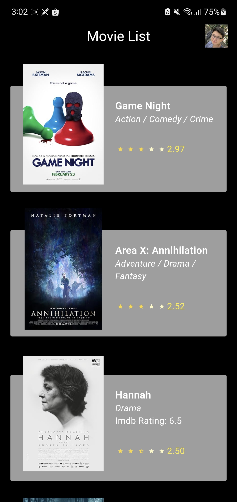
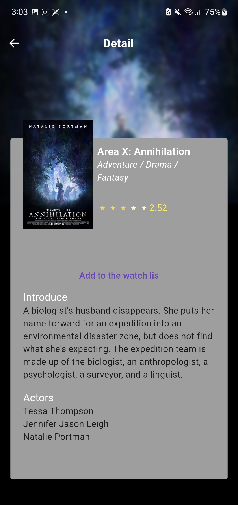

# movies_app

A Movie list project.

## Getting Started

This project is a starting point for a Flutter application.

## Screenshots




## Build
[debug APK](https://drive.google.com/file/d/114n7SWK1mMbmGzi9dImVriaFbaHpHVTY/view?usp=sharing)

## Configured

### Flutter version: stable

Please use [FVM](https://fvm.app/)

```
    fvm flutter packages get && fvm flutter packages upgrade
```


Run build runner 
```
fvm flutter pub run build_runner build

```


